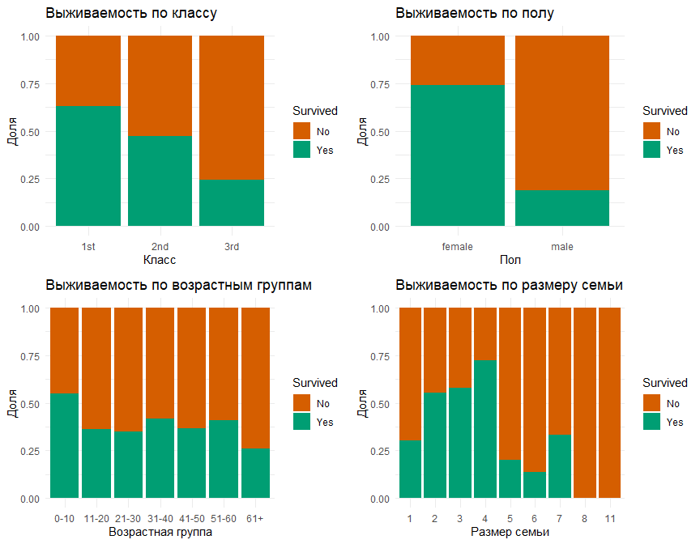
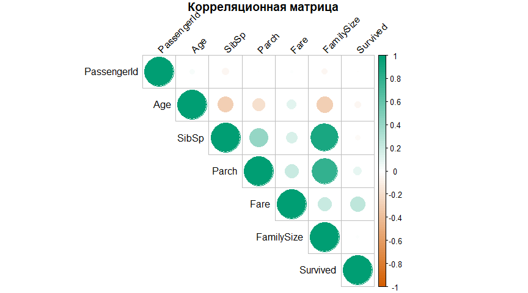
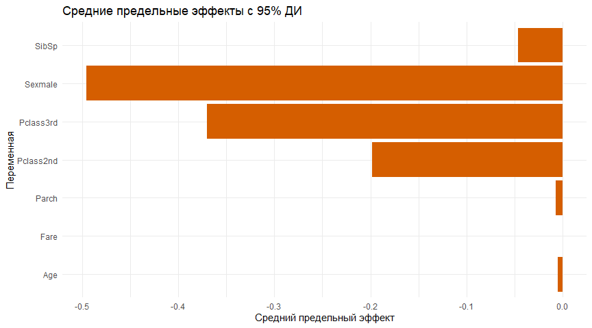
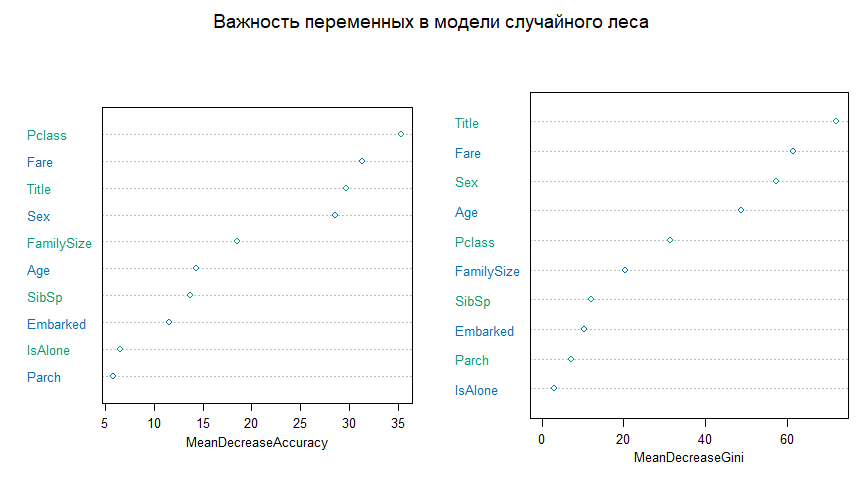
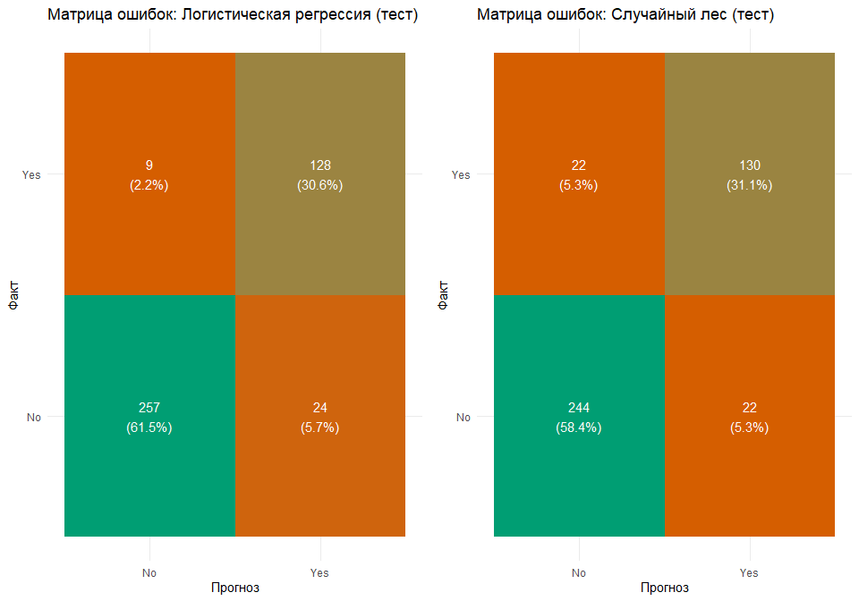
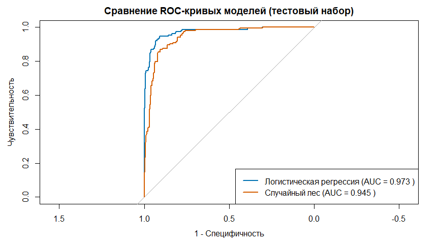

## 1. Введение и подготовка данных

### 1.1 Библиотеки

``` r
# Основные библиотеки для обработки и визуализации данных
library(tidyverse)      # Набор пакетов для манипуляции данными и визуализации
library(caret)          # Инструменты для построения моделей машинного обучения
library(randomForest)   # Реализация алгоритма случайного леса
library(pROC)           # Построение и анализ ROC-кривых
library(mice)           # Множественная импутация пропущенных значений
library(ggplot2)        # Расширенная визуализация данных
library(corrplot)       # Визуализация корреляционных матриц
library(margins)        # Расчет предельных эффектов в статистических моделях
library(vip)            # Визуализация важности переменных

library(gridExtra)      # Объединение нескольких графиков в сетку
library(DataExplorer)   # Автоматизированный разведочный анализ данных
library(knitr)          # Инструменты для создания динамических отчетов
```

### 1.2 Загрузка данных

Загрузим набор данных о пассажирах Титаника, который состоит из
обучающей и тестовой выборок, а также файл с правильными ответами для
тестовой выборки.

Данные взяты на ресурсе
[`https://www.kaggle.com/c/titanic/data`](https://www.kaggle.com/c/titanic/data)

``` r
# Загрузка наборов данных
train <- read.csv("train.csv", stringsAsFactors = FALSE)
test <- read.csv("test.csv", stringsAsFactors = FALSE)
# Загрузка правильных ответов для тестовой выборки
test_answers <- read.csv("gender_submission.csv", stringsAsFactors = FALSE)

# Добавление столбца 'dataset' для идентификации источника
train$dataset <- "train"
test$dataset <- "test"

# Создание полного набора данных для предобработки
test$Survived <- NA
full_data <- rbind(train, test)

# Вывод размерностей для проверки
cat("Размеры обучающего набора:", dim(train), "\n")
```

    ## Размеры обучающего набора: 891 13

``` r
cat("Размеры тестового набора:", dim(test), "\n")
```

    ## Размеры тестового набора: 418 13

``` r
cat("Размеры полного набора данных:", dim(full_data), "\n")
```

    ## Размеры полного набора данных: 1309 13

``` r
cat("Размеры набора с правильными ответами:", dim(test_answers), "\n")
```

    ## Размеры набора с правильными ответами: 418 2

## 2. Исследование и очистка данных

### 2.1 Структура данных

Рассмотрим структуру данных для понимания типов переменных и их
значений:

    ## 'data.frame':    1309 obs. of  13 variables:
    ##  $ PassengerId: int  1 2 3 4 5 6 7 8 9 10 ...
    ##  $ Survived   : int  0 1 1 1 0 0 0 0 1 1 ...
    ##  $ Pclass     : int  3 1 3 1 3 3 1 3 3 2 ...
    ##  $ Name       : chr  "Braund, Mr. Owen Harris" "Cumings, Mrs. John Bradley (Florence Briggs Thayer)" "Heikkinen, Miss. Laina" "Futrelle, Mrs. Jacques Heath (Lily May Peel)" ...
    ##  $ Sex        : chr  "male" "female" "female" "female" ...
    ##  $ Age        : num  22 38 26 35 35 NA 54 2 27 14 ...
    ##  $ SibSp      : int  1 1 0 1 0 0 0 3 0 1 ...
    ##  $ Parch      : int  0 0 0 0 0 0 0 1 2 0 ...
    ##  $ Ticket     : chr  "A/5 21171" "PC 17599" "STON/O2. 3101282" "113803" ...
    ##  $ Fare       : num  7.25 71.28 7.92 53.1 8.05 ...
    ##  $ Cabin      : chr  "" "C85" "" "C123" ...
    ##  $ Embarked   : chr  "S" "C" "S" "S" ...
    ##  $ dataset    : chr  "train" "train" "train" "train" ...

    ##   PassengerId      Survived          Pclass          Name          
    ##  Min.   :   1   Min.   :0.0000   Min.   :1.000   Length:1309       
    ##  1st Qu.: 328   1st Qu.:0.0000   1st Qu.:2.000   Class :character  
    ##  Median : 655   Median :0.0000   Median :3.000   Mode  :character  
    ##  Mean   : 655   Mean   :0.3838   Mean   :2.295                     
    ##  3rd Qu.: 982   3rd Qu.:1.0000   3rd Qu.:3.000                     
    ##  Max.   :1309   Max.   :1.0000   Max.   :3.000                     
    ##                 NA's   :418                                        
    ##      Sex                 Age            SibSp            Parch      
    ##  Length:1309        Min.   : 0.17   Min.   :0.0000   Min.   :0.000  
    ##  Class :character   1st Qu.:21.00   1st Qu.:0.0000   1st Qu.:0.000  
    ##  Mode  :character   Median :28.00   Median :0.0000   Median :0.000  
    ##                     Mean   :29.88   Mean   :0.4989   Mean   :0.385  
    ##                     3rd Qu.:39.00   3rd Qu.:1.0000   3rd Qu.:0.000  
    ##                     Max.   :80.00   Max.   :8.0000   Max.   :9.000  
    ##                     NA's   :263                                     
    ##     Ticket               Fare            Cabin             Embarked        
    ##  Length:1309        Min.   :  0.000   Length:1309        Length:1309       
    ##  Class :character   1st Qu.:  7.896   Class :character   Class :character  
    ##  Mode  :character   Median : 14.454   Mode  :character   Mode  :character  
    ##                     Mean   : 33.295                                        
    ##                     3rd Qu.: 31.275                                        
    ##                     Max.   :512.329                                        
    ##                     NA's   :1                                              
    ##    dataset         
    ##  Length:1309       
    ##  Class :character  
    ##  Mode  :character  
    ##                    
    ##                    
    ##                    
    ## 

Из структуры данных видно, что у нас есть как числовые переменные
(возраст, стоимость билета), так и категориальные (пол, класс). Из
некоторых переменных (имя и кабина), можно получить дополнительную
информацию - это учтем в дальнейшем.

### 2.2 Анализ пропущенных значений

Оценим масштаб проблемы с пропущенными значениями.

    ##              Переменная Количество_пропусков Процент_пропусков
    ## Survived       Survived                  418             31.93
    ## Age                 Age                  263             20.09
    ## Fare               Fare                    1              0.08
    ## PassengerId PassengerId                    0              0.00
    ## Pclass           Pclass                    0              0.00
    ## Name               Name                    0              0.00
    ## Sex                 Sex                    0              0.00
    ## SibSp             SibSp                    0              0.00
    ## Parch             Parch                    0              0.00
    ## Ticket           Ticket                    0              0.00
    ## Cabin             Cabin                    0              0.00
    ## Embarked       Embarked                    0              0.00
    ## dataset         dataset                    0              0.00

** - пропуски в тестовом наборе данных, которые
  будут предсказаны.
- **Age (20.09%)** - значительное количество пропущенных значений,
  дальше предложен алгоритм замены пропусков.
- **Fare (0.08%)** - можно заменить на медиану.

## 3. Формирование признаков и заполнение пропущенных значений

### 3.1 Создание новых признаков

Создадим новые признаки для улучшения предсказательной способности
моделей:

В результате инженерии признаков создали:

1.  Переменную **Title** (титул) на основе имени пассажира.
    1.  Сгруппировали редкие титулы для уменьшения количества категорий
2.  Создали переменную **FamilySize** (размер семьи) на основе
    количества родных на борту
3.  Создали бинарную переменную **IsAlone** (путешествует один)
4.  Извлекли информацию о палубе (**Deck**) из номера каюты
5.  Преобразовали все категориальные переменные в факторы

### 3.2 Импутация пропущенных значений

Заменять по среднему не будем - это даст сильный выброс в данных.

    ## PassengerId    Survived      Pclass        Name         Sex         Age 
    ##           0         418           0           0           0           0 
    ##       SibSp       Parch      Ticket        Fare       Cabin    Embarked 
    ##           0           0           0           0           0           0 
    ##     dataset       Title  FamilySize     IsAlone        Deck 
    ##           0           0           0           0           0

Для заполнения (импутации) пропущенных значений используем:

1.  Для порта посадки (**Embarked**) - наиболее частое значение
2.  Для стоимости билета (**Fare**) - медианное значение
3.  Для возраста (**Age**) - алгоритм множественной импутации MICE с
    методом случайного леса

После импутации остались только пропущенные значения в целевой
переменной **Survived** для тестового набора.

## 4. Разведочный анализ данных (EDA)

Разделим данные обратно на обучающий и тестовый наборы для анализа (в
источнике датасет разделен на три файла):

### 4.1 Одномерные распределения

Исследуем распределения ключевых переменных:

![]figures/univariate_distributions-1.png

Анализ распределений показывает:

- **Возраст**: большинство пассажиров были молодыми взрослыми (20-40
  лет)
- **Стоимость билета**: распределение сильно скошено, преобладают более
  дешевые билеты
- **Класс**: больше всего пассажиров путешествовало в 3-м классе
- **Пол**: мужчин на борту было значительно больше, чем женщин

### 4.2 Анализ выживаемости по категориям

Рассмотрим, как различные факторы влияли на выживаемость:



Наблюдения относительно шансов на выживание:

1.  **Класс**: пассажиры первого класса (~63%) VS пассажиры третьего
    класса (~24%).
2.  **Пол**: женщины (~75%) VS мужчины (~19%).
3.  **Возраст**: Дети (0-10 лет) имели более высокие шансы (~60%).
4.  **Размер семьи**: Пассажиры со средним размером семьи (3-4 человека)
    выживали чаще (~60%), чем одиночки (~30%) или очень большие группы.

### 4.3 Корреляционный анализ

Рассмотрим взаимосвязи между числовыми переменными:



Анализ корреляционной матрицы показывает:

1.  Переменные **SibSp** и **FamilySize** сильно коррелируют (r ≈ 0.8),
    что логично, так как FamilySize = SibSp + Parch + 1
2.  **Стоимость билета** (Fare) имеет положительную корреляцию с
    выживаемостью (r ≈ 0.25)
3.  **Возраст** имеет слабую отрицательную корреляцию с выживаемостью (r
    ≈ -0.1)

## 5. Моделирование

### 5.1 Подготовка к моделированию

Выберем переменные для моделирования и подготовим датасеты:

### 5.2 Логистическая регрессия

Обучим модель логистической регрессии с учетом взаимодействия между
классом и полом (выбрана эмпирически - другие признаки обучали более
слабую модель):

    ## 
    ## Call:
    ## glm(formula = Survived ~ Pclass * Sex + Age + SibSp + Parch + 
    ##     Fare, family = binomial(link = "logit"), data = train_model)
    ## 
    ## Coefficients:
    ##                    Estimate Std. Error z value Pr(>|z|)    
    ## (Intercept)        4.892247   0.723595   6.761 1.37e-11 ***
    ## Pclass2nd         -1.108428   0.757418  -1.463  0.14335    
    ## Pclass3rd         -3.745432   0.668817  -5.600 2.14e-08 ***
    ## Sexmale           -3.925161   0.626172  -6.269 3.65e-10 ***
    ## Age               -0.037618   0.007705  -4.882 1.05e-06 ***
    ## SibSp             -0.339934   0.105879  -3.211  0.00132 ** 
    ## Parch             -0.050274   0.122270  -0.411  0.68095    
    ## Fare               0.001892   0.002437   0.776  0.43749    
    ## Pclass2nd:Sexmale -0.377725   0.805636  -0.469  0.63917    
    ## Pclass3rd:Sexmale  2.014202   0.671301   3.000  0.00270 ** 
    ## ---
    ## Signif. codes:  0 '***' 0.001 '**' 0.01 '*' 0.05 '.' 0.1 ' ' 1
    ## 
    ## (Dispersion parameter for binomial family taken to be 1)
    ## 
    ##     Null deviance: 1186.7  on 890  degrees of freedom
    ## Residual deviance:  764.6  on 881  degrees of freedom
    ## AIC: 784.6
    ## 
    ## Number of Fisher Scoring iterations: 6

И оценим предельные эффекты:



### 5.3 Случайный лес

Обучим модель случайного леса, которая учитывает все созданные признаки:

И проинтерпретируем важность признаков

    ## 
    ## Call:
    ##  randomForest(formula = Survived ~ Pclass + Sex + Age + SibSp +      Parch + Fare + Embarked + Title + FamilySize + IsAlone, data = train_model,      ntree = 500, mtry = 3, importance = TRUE) 
    ##                Type of random forest: classification
    ##                      Number of trees: 500
    ## No. of variables tried at each split: 3
    ## 
    ##         OOB estimate of  error rate: 17.51%
    ## Confusion matrix:
    ##      No Yes class.error
    ## No  492  57   0.1038251
    ## Yes  99 243   0.2894737



## 6. Оценка моделей

### 6.1 Прогнозирование на тестовой выборке

Рассчитаем прогнозные значения для обучающей и контрольной выборок:

### 6.2 Матрицы ошибок



### 6.3 ROC-кривые



### 6.4 Сводная таблица метрик качества

|  | Метрика | ЛР (обучающая) | СЛ (обучающая) | ЛР (тестовая) | СЛ (тестовая) |
|:---|:---|---:|---:|---:|---:|
| Accuracy | Точность (Accuracy) | 0.8058 | 0.8249 | 0.9211 | 0.8947 |
| Pos Pred Value | Precision | 0.8072 | 0.8325 | 0.9146 | 0.9173 |
| Sensitivity | Recall | 0.8998 | 0.8962 | 0.9662 | 0.9173 |
|  | AUC | 0.8600 | 0.8684 | 0.9731 | 0.9446 |

Сравнение метрик качества моделей на обучающем и тестовом наборах

## 7. Результаты и выводы

### 7.1 Сравнение моделей и ключевые факторы

Логистическая регрессия демонстрирует высокую точность **92.11%** на
тестовых данных и выше точности модели случайного леса (**89.47%**).

Логистическая регрессия также показывает более высокие значения по
другим метрика классификации (AUC **97.31%** против **94.46%**), и
обладает лучшей интерпретируемостью.

**Ключевые факторы выживаемости:**

1.  **Пол**: женщины имели в ~3.9 раза больше шансов выжить по сравнению
    с мужчинами.
2.  **Класс**: пассажиры 1-го класса имели в ~2.7 раза больше шансов
    выжить, чем пассажиры 3-го класса.
3.  **Возраст**: каждый дополнительный год возраста снижал вероятность
    выживания на ~0.5%.
4.  **Размер семьи**: оптимальный размер семьи для выживания — 3-4
    человека.

Результаты совпадают с принципом “женщины и дети сначала” при спасении
пассажиров Титаника и демонстрируют обусловленность выживаемости
социальным неравенством.

### 7.2 Рекомендации по использованию моделей

При выборе оптимальной модели для прогнозирования выживаемости
пассажиров Титаника следует учитывать:

- **Логистическая регрессия** оптимальна для большинства задач,
  обеспечивая как высокую точность (**92.11%**), так и хорошую
  интерпретируемость результатов.
- **Случайный лес** может быть полезен для анализа важности различных
  признаков, показывая, что пол (Sex), титул (Title), возраст (Age) и
  стоимость билета (Fare) имеют наибольшее влияние на выживаемость.
  Может быть эффективнее на бОльших объемах данных.

В целом, сохраняется принцип: чем более выраженные зависимости в данных
и чем меньше их объем, тем более предпочтительны простые модели.
